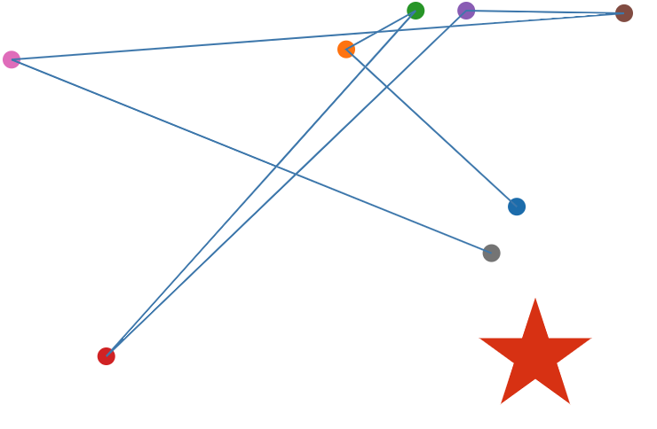
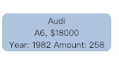

Assignment 1 - Hello World: GitHub and d3  
===

Webpage Link: "https://yuncm98.github.io/01-ghd3/"

Introduction 
---
This repo hosts an live webpage for CS573 assignment 1. 
Based on the requirments of the assignment, this page includes 8 circles and a red star. In addition, there are lines connecting those circles. The position of each circle is located based on the value in [mockCars.json](mockCars.json) file, which is generated using [Mockaroo] (https://www.mockaroo.com/). 

The screenshot below is the main page for the website:





When the user move the mouse on any circle, there is a grey rectangle that will pop up at the left bottom of the webpage. It will present all the information related to the specific circle and dispear later when the mouse is moved over. Here is an example of the information diagram:  



At last, just for practice, the red star is added a short animation.

Technical Achievements 
---
- Reviewed HTML, CSS, JS knowledge
- Got familiar with D3 V5 library
  - Load data from a JSON file into HTML file and then implement data visualization
  - Add a short animation and implement interactive event
- Improved git skills 
```
git checkout branch
git fetch
git merge
```
- Starting to use formatting syntax when writing Readme file

Design Achievements 
---
- Basic interactive webpage
- A short animation 
- Several fundamental shapes including circle, line, rectangle and polygon
- Controlling colors and positions for different items


Resource
---
- Mockaroo (https://www.mockaroo.com/)
- D3.v5 (https://d3js.org/d3.v5.min.js)
- div.tooltip code: (https://bl.ocks.org/d3noob/257c360b3650b9f0a52dd8257d7a2d73)
