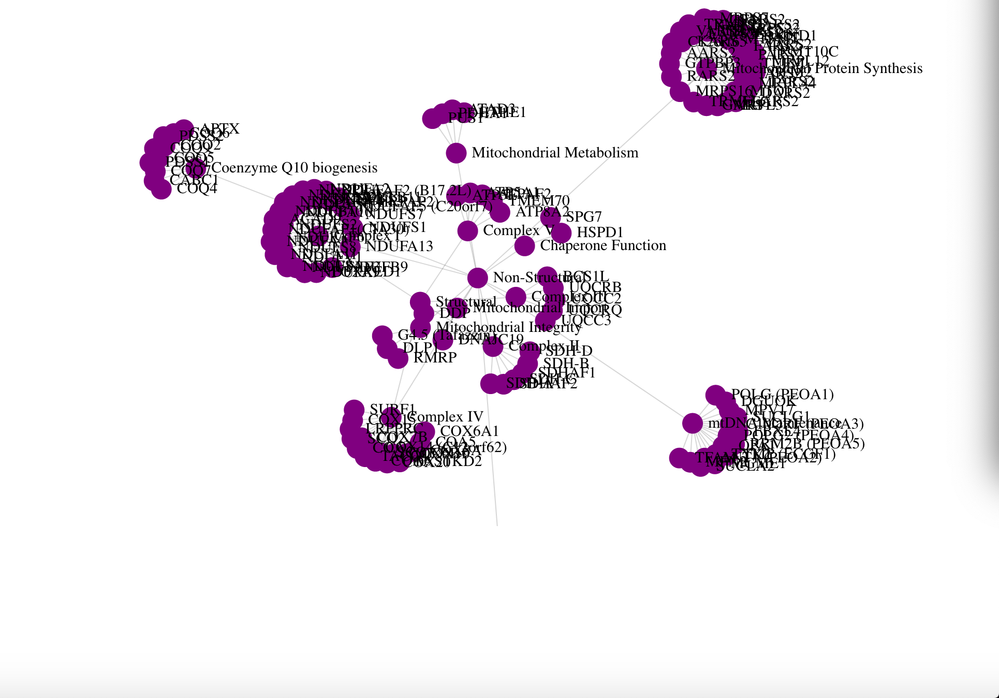

Assignment 1 - Hello World: GitHub and d3  
===
NOTE: This assignment is not quite complete. Swapping out the svg shapes is not as simple as I anticipated. It will also require using different attributes for the circles versus the other shapes with respect to positioning in the "tick" function for the simulation. I tried to do this with a filter, but it did not work as expected.

Visualization
---
[Here is the published link](./index.html) for this visualiation.

A screenshot of the original version of the visualization, before tinkering with shapes:

In the current version of the visualization the nodes and edges fulfill the shape requirements, with circles, squares, and polygons (triangles) used as nodes and the lines forming the edges. Unfortunately, the alignment of the node shapes with the network fell apart when different shapes were appended to the graph using a filter on the level.
Currently, the circles are hidden under the squares in the top, left corner. Next to them are the triangles. When working correctly, the circles would be the outermost nodes (level 3), while polygons would be the level 2 node, and rectangles would be the two root (level 1) nodes.
The information displayed was modified from data found at [MitoMap](https://www.mitomap.org/MITOMAP), specifically the [structural](https://www.mitomap.org/foswiki/bin/view/MITOMAP/NuclearGenesStructural) and [non-structural](https://www.mitomap.org/foswiki/bin/view/MITOMAP/NuclearGenesNonStructural) nuclear genes associated with mitochondrial DNA. This data was used to construct the node and edge data variables used to build the network diagram.

Foundational Code Source and References
---
Demo Program used as a foundation for this visualization:
[Interactive & Dynamic Force-Directed Graphs with D3](https://medium.com/ninjaconcept/interactive-dynamic-force-directed-graphs-with-d3-da720c6d7811) by Robin Frischmann, Feb 13, 2017
More specifically, [this section of code](https://github.com/ninjaconcept/d3-force-directed-graph/blob/master/example/2-relations.html) from the associated git was used as a foundation to build upon.

This visualization utilizes the d3-force module. The documentation found [here](https://github.com/d3/d3-force/blob/master/README.md) was used to better understand the previously mentioned demo.

To meet the assignment objective of using different shapes, I attempted to use multiple shapes to represent the nodes at different levels. It became [apparent that using a function within append was not the same as using a function within attribute](https://stackoverflow.com/questions/28485046/d3-append-with-function-argument).

[Using a filter to append a shape based on a function with a conditional argument](https://stackoverflow.com/questions/20335118/filter-data-in-d3-to-draw-either-circle-or-square) seemed like a better option, so it is the option in used in the current version of this visualization.

Technical and Design Achievements
---
The technical achievements made were translating data into a form usable to create this visualization from tables on a website. This was done by importing the data into Excel, then using columns to insert the necessary quotations and brackets, then exporting as a csv file and using that to make a json file. Unfortunately, importing two json files onto one page had its own set of difficulties that were circumvented by directly embedding into the script. In the future, the objective is to find out how to properly use two or more different data sources. Additionally, a network diagram was created, though it was not successfully modified as intended.

There were not as many design achievements on the page as intended. They are lacking because of a hurdle appending the nodes correctly so they would associate with the edges. If the original plan were to come to fruition, to accommodate the density of gene associated nodes in some areas of the layout the opacity of the individual circular nodes would be significantly decreased. The hope would be to highlight that there are multiple nodes rather than just a singularly colored glob around the function node.
