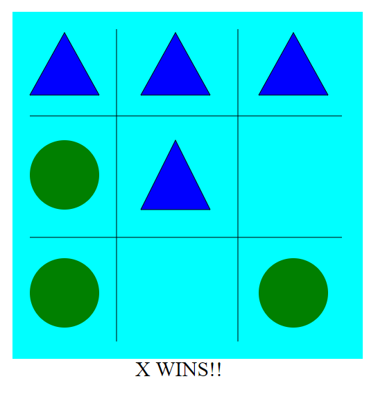

Assignment 1 - Hello World: GitHub and d3  
===

Description:-
---
X and O is a simple, fun and popular game, and my original intention was to simulate an instance of this game. But unfortunately, since I am new to d3, my understanding of using transitions and other dynamic components was inaccurate, and hence I was not able to use them as I had intended to. In the end, I had to content myself with just showing the final result and snapshot of the game, which is shown below: -

gh-pages site link: -
---
https://umeshnair.github.io/01-ghd3/index.html

Technical Achievements: -
---
1. Gained a good understanding of what are svg's and how to work with them.
2. Successfully drew different shapes like circles, rectangles with distinct dimensions and color fills.
3. Improved upon my initial understanding of using transitions and making visualizations dynamic.

Design Achievements: -
---
1. Layout and placement of shapes and objects on the screen to generate an effective visualization.
2. Gained an understanding of colors and its combinations.
3. Gained an understanding of the use of different shapes and their size variations to clearly differentiate the objects.

References:
https://stackoverflow.com/questions/13204562/proper-format-for-drawing-polygon-data-in-d3
